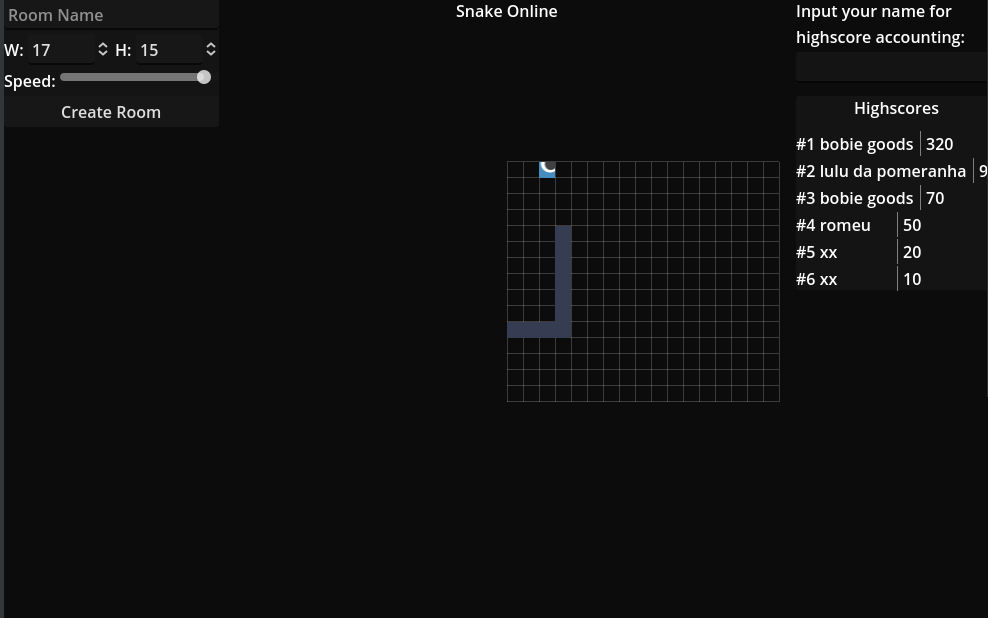

# snake online

A web server implementation of the classic snake game. It was part of my course on learning async Rust, that's why I implemented the entire web stack (HTTP and websocket datagrams parsing directly from TCP streams).

The game runs in the backend, while the frontend is a simple HTML+JS client that connects to the websocket (I made it in godot and exported it into HTML inside public folder).

It is being hosted right [here](https://snakeonline.rilpires.com).

| Environment variable | Default value | Description |
|----------------------|---------------|-------------|
| APP_PORT             | 8080          | The port the application will listen on |
| APP_HOST             | 0.0.0.0       | The host the application will bind to |

## TODOs
TODOs I'd like to implement:
- persistent storage of highscores (maybe with sqlite)
- multiple rooms & snakes inside the same game
